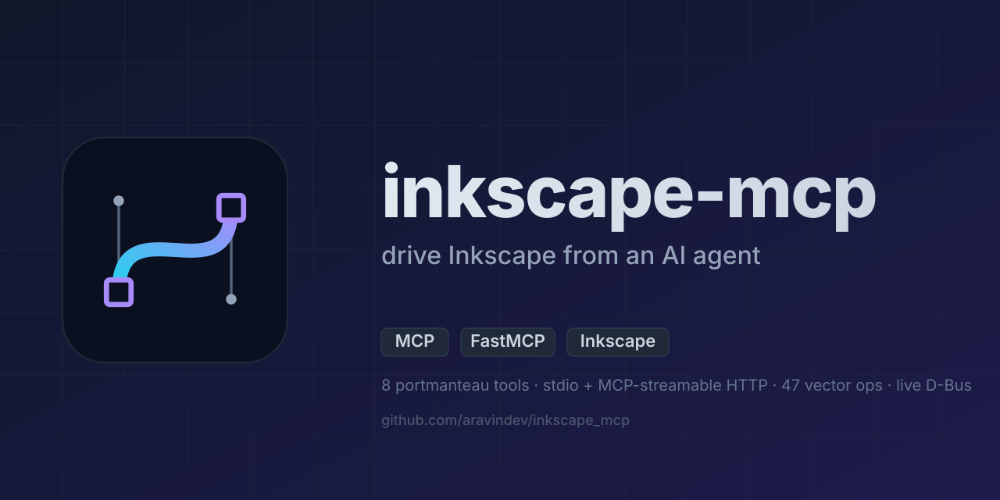

# Inkscape MCP

<p align="center">
  
</p>

Let your AI agent design, edit, and analyze vector graphics through Inkscape — live alongside a running Inkscape window, or headless from the command line.

<p>
  <a href="https://pypi.org/project/inkscape-mcp/"></a>
  <a href="https://pypi.org/project/inkscape-mcp/"></a>
  <a href="https://pypi.org/project/inkscape-mcp/"></a>
  <a href="https://github.com/aravindev/inkscape_mcp/actions/workflows/ci.yml"></a>
  <a href="https://github.com/aravindev/inkscape_mcp/blob/main/LICENSE"></a>
</p>

<p>
  <a href="https://modelcontextprotocol.io"></a>
  <a href="https://github.com/PrefectHQ/fastmcp"></a>
  <a href="https://inkscape.org"></a>
  <a href="https://github.com/astral-sh/ruff"></a>
  <a href="https://github.com/pre-commit/pre-commit"></a>
</p>

With Inkscape MCP, your coding agent can do everything a designer does in Inkscape — sketch and reshape paths, apply effects and filters, render LaTeX equations, generate barcodes and QR codes, convert between formats, query and rewrite document structure — through plain conversation instead of menu clicks.

Pair it with a **running Inkscape window** and the agent works alongside you — it sees what you have selected, opens property dialogs on your behalf, applies edits that appear on the canvas in real time (each one a normal undo entry you can roll back), and rasterizes its own work to inspect and refine the result. Or run it **headlessly** to batch-convert artwork, automate exports, and build pipelines around vector assets — no GUI required. The full Inkscape feature surface, including its hundreds of bundled extensions, is reachable as tool calls.

## How it works

1. The agent calls one of eight portmanteau tools — `inkscape_file`, `inkscape_vector`, `inkscape_analysis`, `inkscape_system`, `inkscape_extension`, `inkscape_gradient`, `inkscape_metadata`, or `inkscape_live` — with an `operation` string that picks the actual behavior.
2. For headless work the server dispatches through `InkscapeCliWrapper`, which builds and runs an `inkscape --actions=...` (or `--export-...`) command. For live-canvas work it talks to a running Inkscape window over D-Bus and stages SVG fragments through the clipboard.
3. Inkscape reads your input file (or the open document), runs the operation, and writes the output.
4. The server returns dimensions, file paths, validation results, or whatever the operation produces — typed and trimmed for the agent's context window.

No external network. Just the Inkscape binary, an optional running Inkscape window, and your local files.

## Getting started

> Tested with **Inkscape 1.4.4** on Ubuntu 24.04.

```bash
# 1. Install Inkscape + system headers for pycairo / pygobject
sudo add-apt-repository ppa:inkscape.dev/stable
sudo apt update
sudo apt install inkscape libcairo2-dev libgirepository-2.0-dev libgirepository1.0-dev pkg-config python3-dev \
                 xclip
# xclip stages SVG fragments for clipboard-based insert into the canvas.
# On Wayland substitute wl-clipboard for xclip — clipboard ops auto-detect.

# 2. Register with Claude Code (uvx fetches inkscape-mcp from PyPI on first run)
claude mcp add inkscape_mcp -s user -- uvx inkscape_mcp
claude mcp list | grep inkscape_mcp   # → ✓ Connected

# 3. (Re)start Inkscape so it picks up the bundled extensions
# The MCP server auto-installs its inkex extensions to
# ~/.config/inkscape/extensions/inkscape_mcp/ on first boot. Inkscape only
# scans the extensions dir at startup, so close + reopen Inkscape once.
# Verify via:
#   inkscape_system(operation="diagnostics")  → bridge.needs_restart should be false
```

That's it. Ask the agent to convert an SVG, query an object's bounding box, run a boolean union — it'll pick the right tool.

### Alternative install paths

```bash
# Plain pip into a venv
pip install inkscape-mcp

# uv into a project
uv add inkscape-mcp
```

The PyPI name is `inkscape-mcp` (hyphen). The Python import name is `inkscape_mcp` (underscore — PEP 8 / valid identifier). Both `pip install inkscape-mcp` and `pip install inkscape_mcp` resolve to the same project (PEP 503 name normalization).

## Configuration

The Claude Code entry the install command above creates looks like:

```json
{
  "mcpServers": {
    "inkscape_mcp": {
      "command": "uvx",
      "args": ["inkscape_mcp"]
    }
  }
}
```

Pin a non-default Inkscape with `INKSCAPE_BIN=/path/to/inkscape` in the server env. Inspect from the agent via `inkscape_system(operation="diagnostics")` — it reports which value came from which source (env var, config file, default).

## Try asking your agent to…

**Editing the file you have open**

- "Recolor everything blue to red"
- "Open document properties — I can't find the DPI setting"
- "Select the pen tool so I can draw a curve"
- "Show me the XML editor"
- "Hide the snap controls bar"
- "Add a drop shadow to all the rectangles"
- "Convert this monogram to a single compound path"
- "Run a boolean union on the two selected shapes"

**Generating SVG content**

- "Drop in an isometric grid into this document"
- "Generate a calendar for the current month and paste it here"
- "Make me a 24×24 settings cog icon — currentColor stroke, round caps"

**Inspection & format conversion**

- "Export this to a 4× PNG and a print-ready PDF"
- "What's the bounding box of #logo-mark?"
- "Optimize this SVG — strip Inkscape namespace cruft"
- "List every object in the file with its type and size"

**Live-canvas workflows** (Inkscape running)

- "Read what I have selected"
- "Align these three icons horizontally with equal spacing"
- "Swap the whole palette to a warmer earth-tone scheme"
- "Add a 3-stop gradient to the rect with id `hero`"

The agent picks the right tool. It can drive 1,073 of Inkscape's actions over D-Bus, fall back to headless CLI when the GUI isn't running, and run inkex extensions for things D-Bus doesn't cover.

## Available tools

- **`inkscape_file`** — load, save, convert (PDF/PNG/EPS/PS/…), validate, batch convert.
- **`inkscape_vector`** — 47 ops covering boolean, tracing, path simplification, optimization, layer export, geometry mutation, barcodes, LPE chains, tile clones.
- **`inkscape_analysis`** — quality scoring, statistics, object lists, layer structure.
- **`inkscape_system`** — server status, diagnostics, extension discovery and execution.
- **`inkscape_extension`** — discover and invoke any installed inkex extension (headless or on the live canvas).
- **`inkscape_gradient`** — gradient-stop manipulation; linear↔radial conversion.
- **`inkscape_metadata`** — read/write Dublin-Core RDF metadata.
- **`inkscape_live`** — drive the running GUI over D-Bus: live edits, paste-in-place, XML edits, `rasterize` so the agent can see the canvas (preserves undo).

Full operation list in [`docs/TOOLS.md`](docs/TOOLS.md).

## Learn more

- [docs/INSTALL.md](docs/INSTALL.md) — full install walkthrough.
- [docs/TOOLS.md](docs/TOOLS.md) — every operation per tool.
- [docs/TROUBLESHOOTING.md](docs/TROUBLESHOOTING.md) — when things break.
- [docs/reference/](docs/reference/) — captured Inkscape 1.4.4 `--action-list` and `--help`.

## Star history

[](https://star-history.com/#aravindev/inkscape_mcp&Date)

## Support

If you like my work and found this useful, feel free to support me at [buymeacoffee.com/aravindev](https://buymeacoffee.com/aravindev).

<a href="https://buymeacoffee.com/aravindev">
  
</a>

## License

MIT — see [`LICENSE`](LICENSE). This project is a fork of upstream MIT-licensed work; attribution and lineage details are in [`NOTICE.md`](NOTICE.md).
